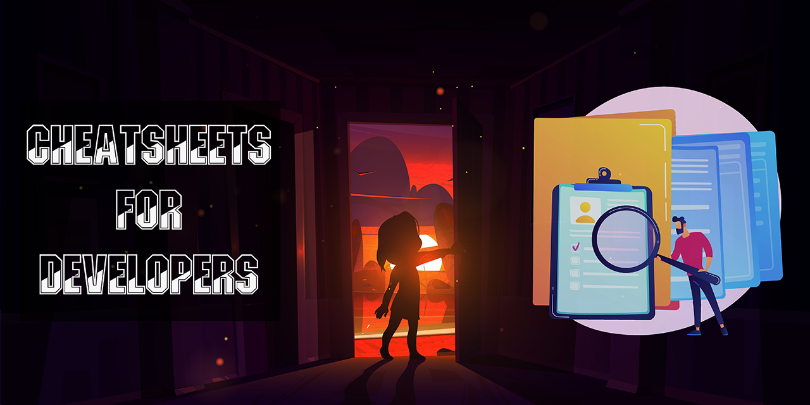

<!-- </img> -->

</img>

<!-- --- -->

<b><h1 align='center'>CHEATSHEETS FOR DEVELOPERS</h1></b>

This `CHEATSHEETS FOR DEVELOPERS` list has been made to enhance the workflow and efficiency. This well curated list will save you time when you just can't remember the code.

---

## CheatSheets Available

| No. | CheatSheet                   | Description                                                                                                                                                                                                                                                           | Link                                                            |
| --- | ---------------------------- | --------------------------------------------------------------------------------------------------------------------------------------------------------------------------------------------------------------------------------------------------------------------- | --------------------------------------------------------------- |
| 1   | Angular                      | Angular is a platform for building mobile and desktop web applications.                                                                                                                                                                                               | [Click Here](./src/pages/sheet/angular.md)                      |
| 2   | Assembly                     | Assembly is a low-level programming language.                                                                                                                                                                                                                         | [Click Here](./src/pages/sheet/assembly.md)                     |
| 3   | AWS                          | AWS is a secure cloud services platform, offering compute power, database storage, content delivery and other functionality to help businesses scale and grow.                                                                                                        | [Click Here](./src/pages/sheet/aws.md)                          |
| 4   | Azure                        | Azure is a cloud computing service created by Microsoft for building, testing, deploying, and managing applications and services through Microsoft-managed data centers.                                                                                              | [Click Here](./src/pages/sheet/azure.md)                        |
| 5   | Bash                         | Bash is a Unix shell and command language written by Brian Fox for the GNU Project as a free software replacement for the Bourne shell.                                                                                                                               | [Click Here](./src/pages/sheet/bash.md)                         |
| 6   | C Language                   | C is a general-purpose, procedural computer programming language supporting structured programming, lexical variable scope, and recursion, with a static type system.                                                                                                 | [Click Here](./src/pages/sheet/c.md)                            |
| 7   | Competitive Programming C++  | Competitive programming is a mind sport usually held over the Internet or a local network, involving participants trying to program according to provided specifications.                                                                                             | [Click Here](./src/pages/sheet/competitive-programming-cpp.md)  |
| 8   | Competitive Programming Java | Competitive programming is a mind sport usually held over the Internet or a local network, involving participants trying to program according to provided specifications.                                                                                             | [Click Here](./src/pages/sheet/competitive-programming-java.md) |
| 9   | C++ Language                 | C++ is a general-purpose programming language created by Bjarne Stroustrup as an extension of the C programming language, or "C with Classes".                                                                                                                        | [Click Here](./src/pages/sheet/cpp-basic.md)                    |
| 10  | C++ STL                      | The Standard Template Library (STL) is a set of C++ template classes to provide common programming data structures and functions such as lists, stacks, arrays, etc.                                                                                                  | [Click Here](./src/pages/sheet/cpp-stl.md)                      |
| 11  | C# Language                  | C# is a general-purpose, multi-paradigm programming language encompassing strong typing, lexically scoped, imperative, declarative, functional, generic, object-oriented (class-based), and component-oriented programming disciplines.                               | [Click Here](./src/pages/sheet/csharp.md)                       |
| 12  | CSS                          | CSS is a style sheet language used for describing the presentation of a document written in a markup language such as HTML.                                                                                                                                           | [Click Here](./src/pages/sheet/css.md)                          |
| 13  | Deep Learning                | Deep learning is a branch of machine learning based on a set of algorithms that attempt to model high-level abstractions in data by using a deep graph with multiple processing layers, composed of multiple nonlinear transformations.                               | [Click Here](./src/pages/sheet/deep-learning.md)                |
| 14  | Django                       | Django is a high-level Python Web framework that encourages rapid development and clean, pragmatic design.                                                                                                                                                            | [Click Here](./src/pages/sheet/django.md)                       |
| 15  | Docker                       | Docker is a set of platform as a service (PaaS) products that use OS-level virtualization to deliver software in packages called containers.                                                                                                                          | [Click Here](./src/pages/sheet/docker.md)                       |
| 16  | Dotnet CLI                   | The .NET Core CLI is a cross-platform toolchain for developing .NET Core applications.                                                                                                                                                                                | [Click Here](./src/pages/sheet/dotnet-cli.md)                   |
| 17  | Express                      | Express is a minimal and flexible Node.js web application framework that provides a robust set of features for web and mobile applications.                                                                                                                           | [Click Here](./src/pages/sheet/expressjs.md)                    |
| 18  | Flutter                      | Flutter is Google's UI toolkit for building beautiful, natively compiled applications for mobile, web, and desktop from a single codebase.                                                                                                                            | [Click Here](./src/pages/sheet/flutter.md)                      |
| 19  | Git                          | Git is a free and open source distributed version control system designed to handle everything from small to very large projects with speed and efficiency.                                                                                                           | [Click Here](./src/pages/sheet/git.md)                          |
| 20  | Go Language                  | Go is a statically typed, compiled programming language designed at Google by Robert Griesemer, Rob Pike, and Ken Thompson.                                                                                                                                           | [Click Here](./src/pages/sheet/go.md)                           |
| 21  | HTML                         | HTML is the standard markup language for creating Web pages.                                                                                                                                                                                                          | [Click Here](./src/pages/sheet/html.md)                         |
| 22  | IOT                          | The Internet of Things (IoT) is the network of physical devices, vehicles, home appliances and other items embedded with electronics, software, sensors, actuators, and connectivity which enables these objects to connect and exchange data.                        | [Click Here](./src/pages/sheet/iot.md)                          |
| 23  | Java Language                | Java is a general-purpose programming language that is class-based, object-oriented, and designed to have as few implementation dependencies as possible.                                                                                                             | [Click Here](./src/pages/sheet/java.md)                         |
| 24  | JavaScript                   | JavaScript is a high-level, interpreted programming language.                                                                                                                                                                                                         | [Click Here](./src/pages/sheet/javascript.md)                   |
| 25  | Kotlin                       | Kotlin is a cross-platform, statically typed, general-purpose programming language with type inference.                                                                                                                                                               | [Click Here](./src/pages/sheet/kotlin.md)                       |
| 26  | Kubectl                      | Kubectl is a command-line tool for controlling Kubernetes clusters.                                                                                                                                                                                                   | [Click Here](./src/pages/sheet/kubectl.md)                      |
| 27  | Laravel                      | Laravel is a web application framework with expressive, elegant syntax.                                                                                                                                                                                               | [Click Here](./src/pages/sheet/laravel.md)                      |
| 28  | Linux                        | Linux is a family of open source Unix-like operating systems based on the Linux kernel, an operating system kernel first released on September 17, 1991, by Linus Torvalds.                                                                                           | [Click Here](./src/pages/sheet/linux.md)                        |
| 29  | Machine Learning             | Machine learning is the study of computer algorithms that improve automatically through experience.                                                                                                                                                                   | [Click Here](./src/pages/sheet/machine-learning.md)             |
| 30  | MacOs Shortcuts              | MacOS is a series of proprietary graphical operating systems developed and marketed by Apple Inc.                                                                                                                                                                     | [Click Here](./src/pages/sheet/macos.md)                        |
| 31  | Markdown                     | Markdown is a lightweight markup language with plain-text-formatting syntax.                                                                                                                                                                                          | [Click Here](./src/pages/sheet/markdown.md)                     |
| 32  | Minikube                     | Minikube is a tool that makes it easy to run Kubernetes locally.                                                                                                                                                                                                      | [Click Here](./src/pages/sheet/minikube.md)                     |
| 33  | MS Office                    | Microsoft Office is an office suite of applications, servers, and services developed by Microsoft.                                                                                                                                                                    | [Click Here](./src/pages/sheet/msoffice.md)                     |
| 34  | MySQL                        | MySQL is an open-source relational database management system.                                                                                                                                                                                                        | [Click Here](./src/pages/sheet/mysql.md)                        |
| 35  | NodeJS                       | Node.js is an open-source, cross-platform, back-end JavaScript runtime environment that runs on the V8 engine and executes JavaScript code outside a web browser.                                                                                                     | [Click Here](./src/pages/sheet/nodejs.md)                       |
| 36  | NumPy                        | NumPy is the fundamental package for scientific computing with Python.                                                                                                                                                                                                | [Click Here](./src/pages/sheet/numpy.md)                        |
| 37  | Pandas                       | Pandas is a fast, powerful, flexible and easy to use open source data analysis and manipulation tool, built on top of the Python programming language.                                                                                                                | [Click Here](./src/pages/sheet/pandas.md)                       |
| 38  | PHP                          | PHP is a server-side scripting language designed for web development but also used as a general-purpose programming language.                                                                                                                                         | [Click Here](./src/pages/sheet/php.md)                          |
| 39  | Python                       | Python is an interpreted, high-level and general-purpose programming language.                                                                                                                                                                                        | [Click Here](./src/pages/sheet/python.md)                       |
| 40  | R Language                   | R is a programming language and free software environment for statistical computing and graphics supported by the R Foundation for Statistical Computing.                                                                                                             | [Click Here](./src/pages/sheet/r-programming.md)                |
| 41  | React Native                 | React Native is an open-source mobile application framework created by Facebook, Inc. It is used to develop applications for Android, Android TV, iOS, macOS, tvOS, Web, Windows and UWP by enabling developers to use React along with native platform capabilities. | [Click Here](./src/pages/sheet/react-native.md)                 |
| 42  | ReactJS                      | React is a JavaScript library for building user interfaces.                                                                                                                                                                                                           | [Click Here](./src/pages/sheet/react.md)                        |
| 43  | Regex                        | A regular expression, regex or regexp is a sequence of characters that define a search pattern.                                                                                                                                                                       | [Click Here](./src/pages/sheet/regex.md)                        |
| 44  | Security Plus                | Security+ is an IT security certification from CompTIA.                                                                                                                                                                                                               | [Click Here](./src/pages/sheet/securityplus.md)                 |
| 45  | Spring Boot                  | Spring Boot makes it easy to create stand-alone, production-grade Spring based Applications that you can "just run".                                                                                                                                                  | [Click Here](./src/pages/sheet/spring-boot.md)                  |
| 46  | Vi Emacs Nano                | Vi, Emacs, and Nano are three text editors that are available on most Linux distributions.                                                                                                                                                                            | [Click Here](./src/pages/sheet/vi-emacs-nano.md)                |
| 47  | VS Code                      | Visual Studio Code is a source-code editor made by Microsoft for Windows, Linux and macOS.                                                                                                                                                                            | [Click Here](./src/pages/sheet/vscode.md)                       |
| 48  | VueJS                        | Vue.js is an open-source Model–view–viewmodel JavaScript framework for building user interfaces and single-page applications.                                                                                                                                         | [Click Here](./src/pages/sheet/vue.md)                          |
| 49  | Windows Terminal             | Windows Terminal is a new, modern, fast, efficient, powerful, and productive terminal application for users of command-line tools and shells like Command Prompt, PowerShell, and WSL.                                                                                | [Click Here](./src/pages/sheet/windows-terminal.md)             |
| 50  | Windows Shortcuts            | Windows is a series of operating systems produced by Microsoft for use on personal computers, including home and business desktops, laptops, tablet PCs, and media center PCs.                                                                                        | [Click Here](./src/pages/sheet/windows.md)                      |

---

We are going to add more CheatSheets in the future. Stay Tuned! 🍁

Feel free to drop a ⭐ if you like this repository.

---

## Contributions

We welcome all kinds of contributions from the open-source community, individuals and partners. We owe our success to
your active involvement.

Contributors can contribute to the project in the following ways:

1. Contributing by fixing existing issues.
2. Submitting improvements to the existing cheatsheets.
3. Submitting new domain cheatsheets.

NOTE: For detailed instructions refer to [CONTRIBUTING.md](./docs/CONTRIBUTING.md)
